# Checkpoint Scenarios

This document describes how the one-to-one checkpoint system handles various user workflows.

## Overview

The system uses:
- **Shadow branches** (`entire/<commit-hash>-<worktree-hash>`) - temporary storage for checkpoint data
- **FilesTouched** - accumulates files modified during the session
- **1:1 checkpoints** - each commit gets its own unique checkpoint ID
- **Content-aware overlap** - prevents linking commits where user reverted session changes

## State Machine

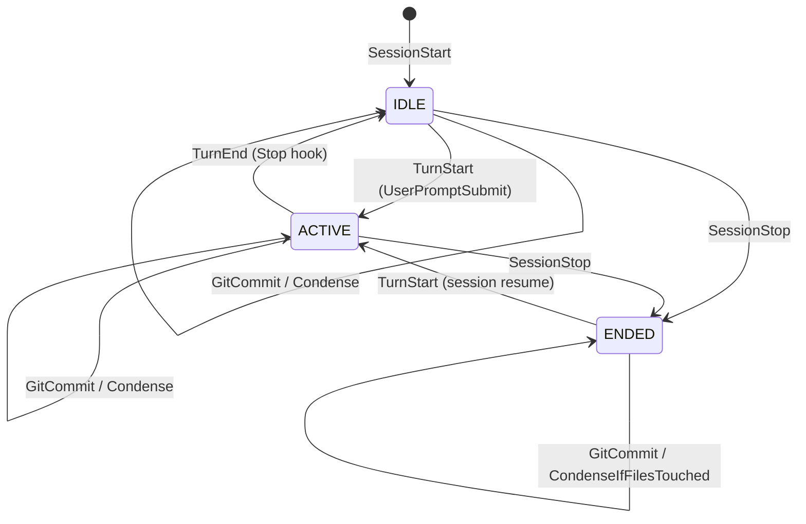

---

## Scenario 1: Prompt → Changes → Prompt Finishes → User Commits

The simplest workflow: user runs a prompt, Claude makes changes, prompt finishes, then user manually commits.

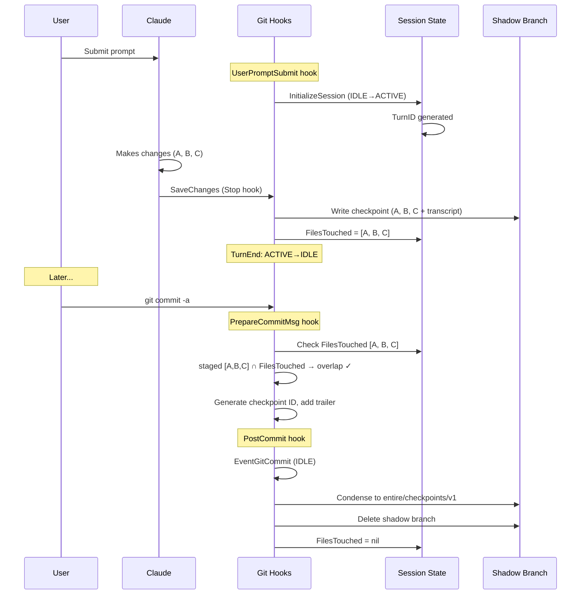

### Key Points
- Shadow branch holds checkpoint data until user commits
- PrepareCommitMsg adds `Entire-Checkpoint` trailer
- PostCommit condenses to permanent storage and cleans up

---

## Scenario 2: Prompt Commits Within Single Turn

Claude is instructed to commit changes, so the commit happens during the ACTIVE phase.

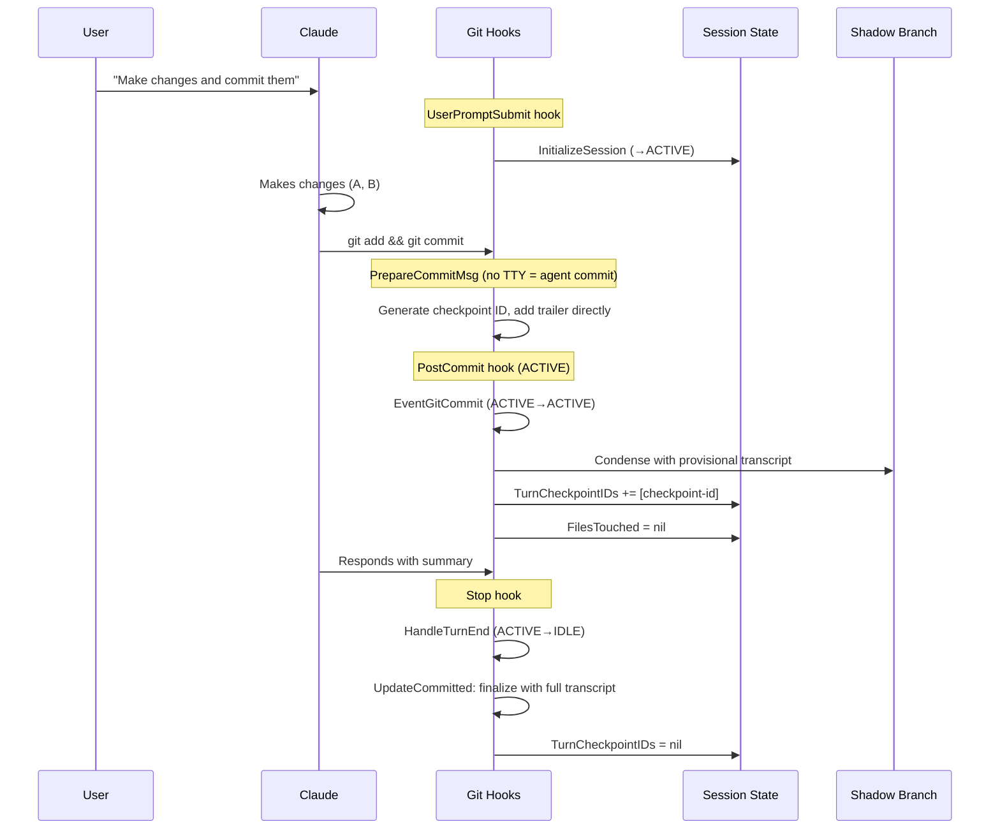

### Key Points
- Agent commits detected by no TTY → fast path adds trailer directly
- **Deferred finalization**: PostCommit saves provisional transcript, HandleTurnEnd updates with full transcript
- TurnCheckpointIDs tracks mid-turn checkpoints for finalization at stop

---

## Scenario 3: Claude Makes Multiple Granular Commits

Claude is instructed to make granular commits, resulting in multiple commits during one turn.

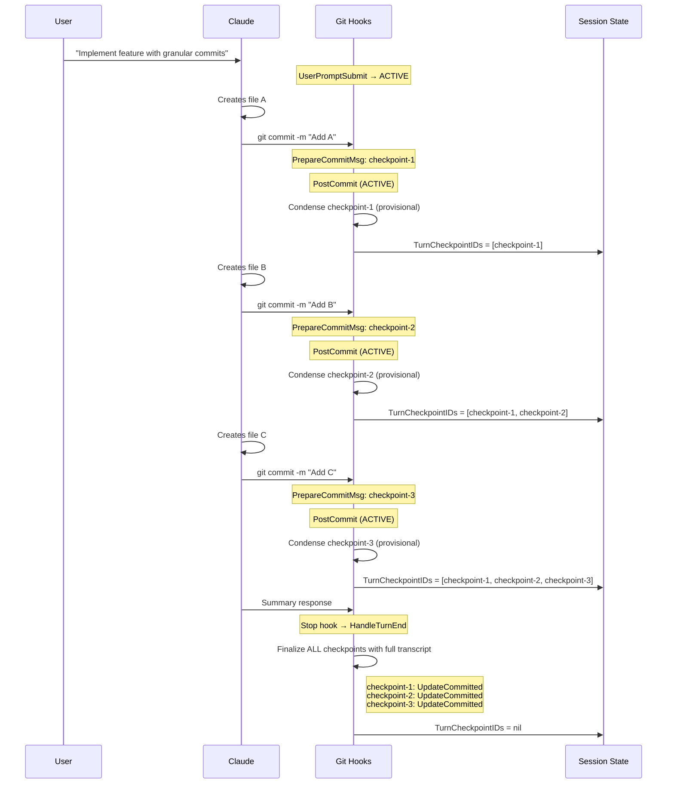

### Key Points
- Each commit gets its own unique checkpoint ID (1:1 model)
- All checkpoints are finalized together at turn end
- Each checkpoint has the full session transcript for context

---

## Scenario 4: User Splits Changes Into Multiple Commits

User decides to create multiple commits from Claude's changes after the prompt finishes.

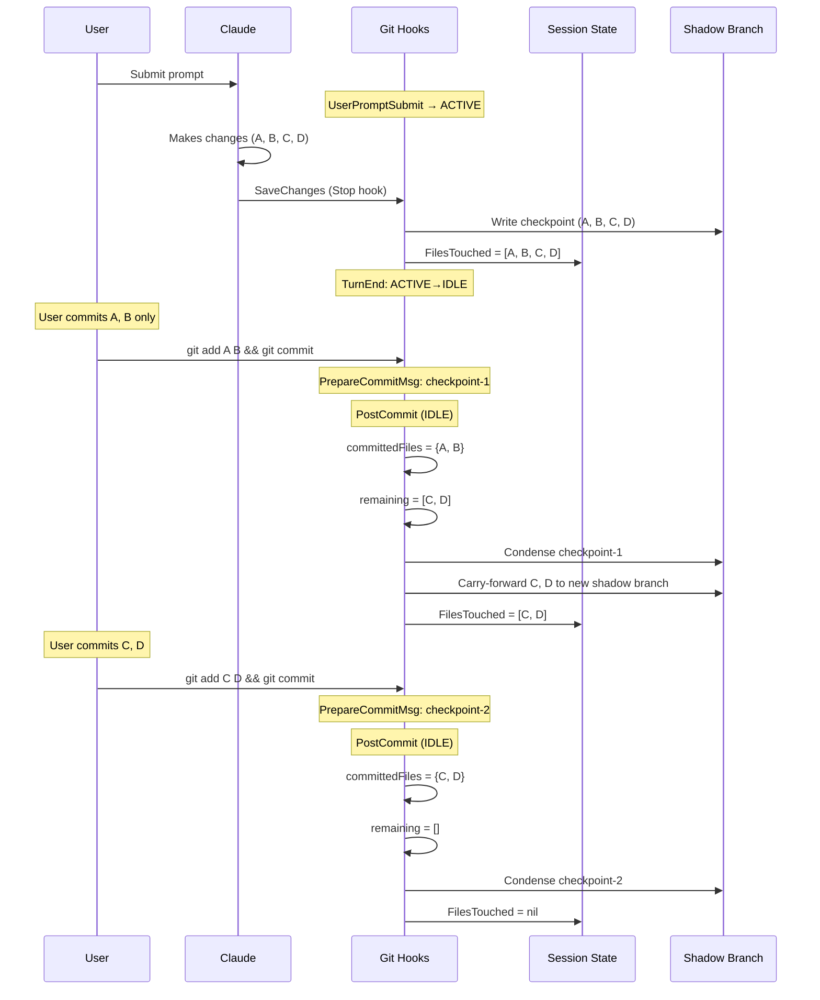

### Key Points
- **Carry-forward logic**: uncommitted files get a new shadow branch
- Each commit gets its own checkpoint ID (1:1 model)
- Both checkpoints link to the same session transcript

### Content-Aware Carry-Forward

The carry-forward logic uses **content-aware comparison** to determine which files have remaining uncommitted changes:

1. **File not in commit** → definitely has remaining changes
2. **File in commit, hash matches shadow branch** → fully committed, no carry-forward
3. **File in commit, hash differs from shadow branch** → partial commit (e.g., `git add -p`), carry forward

This enables splitting changes within a single file across multiple commits (see Scenario 7).

---

## Scenario 5: Partial Commit → Stash → Next Prompt

User commits some changes, stashes the rest, then runs another prompt.

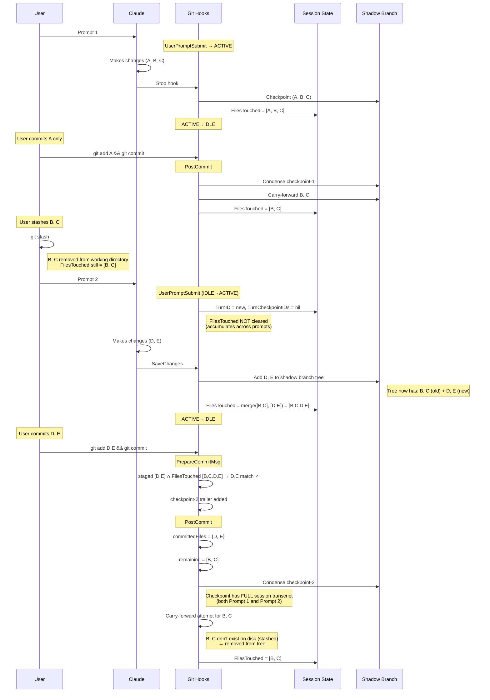

### Key Points
- **FilesTouched accumulates** across prompts (not cleared at TurnStart)
- **Checkpoints have full session context**: D, E commit links to transcript showing BOTH prompts
- **No wrong attribution**: Looking at checkpoint-2, you can see D, E were created by Prompt 2

### Edge Case: Stashed Files Lose Shadow Content

After user commits D, E, the carry-forward for B, C creates an "empty" checkpoint:
- `buildTreeWithChanges` removes non-existent files (B, C are stashed) from the tree
- A shadow branch commit is created, but its tree is just HEAD (no B, C content)
- `FilesTouched` is set to `[B, C]` - the files are still **tracked by name**

**If user later unstashes B, C and commits them:**
- PrepareCommitMsg: staged [B, C] overlaps with FilesTouched [B, C] by filename → trailer added ✓
- PostCommit: checkpoint is created and linked
- But the shadow branch doesn't have the original B, C content from Prompt 1

This is acceptable behavior - stashing files mid-session and committing other files first is an explicit user action. The files are still tracked, but the shadow branch content chain is broken.

---

## Scenario 6: Stash → Second Prompt → Unstash → Commit All

User stashes files, runs another prompt, then unstashes and commits everything together.

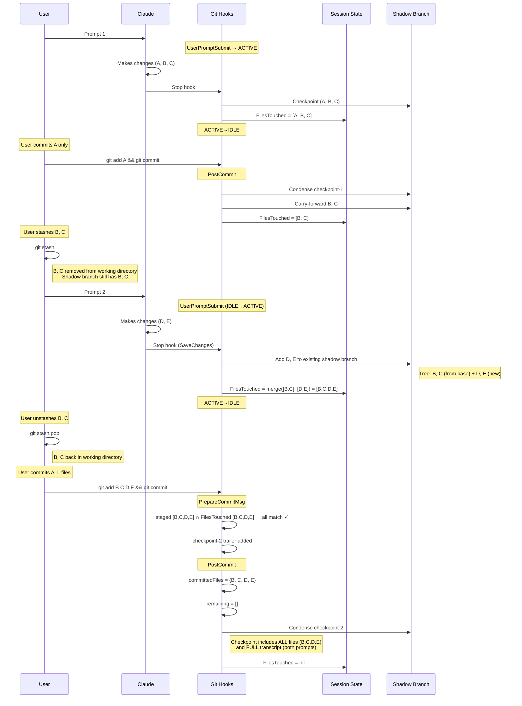

### Key Points
- **Shadow branch accumulates**: D, E added on top of existing B, C from carry-forward
- **All files tracked**: When user commits all together, all four files link to checkpoint
- **Full session context**: Checkpoint transcript shows Prompt 1 created B, C and Prompt 2 created D, E

### Contrast with Scenario 5

| Scenario | User Action | Result |
|----------|-------------|--------|
| **5**: Commit D, E first, then B, C later | Commits D, E while B, C stashed | B, C "fall out" - carry-forward fails, later commit of B, C has no shadow content |
| **6**: Commit all together after unstash | Unstashes B, C, commits B, C, D, E together | All files linked to single checkpoint |

The key difference is **when the commit happens relative to the unstash**:
- If you commit while files are stashed → those files lose their shadow branch content
- If you unstash first, then commit → all files are preserved together

---

## Scenario 7: Partial Staging with `git add -p`

User uses interactive staging to commit only some hunks of a file, leaving other agent changes uncommitted.

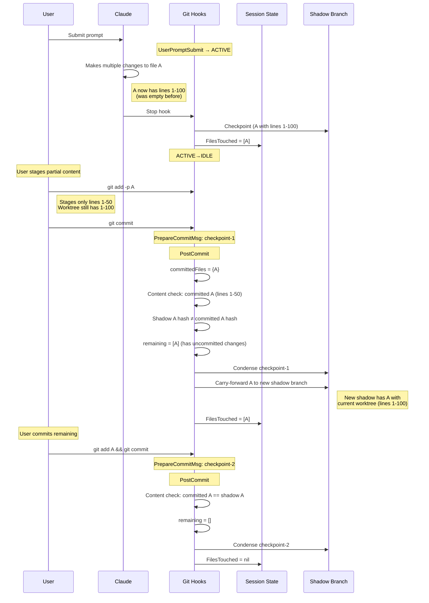

### Key Points
- **Content-aware carry-forward**: Compares git blob hashes, not just filenames
- Partial staging (`git add -p`) within a single file is detected
- Each commit gets proper attribution, even when splitting one file's changes

### How Content Comparison Works

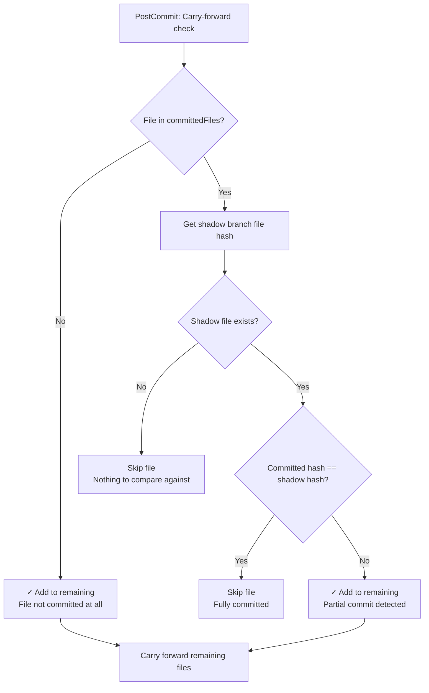

---

## Content-Aware Overlap Detection

Prevents linking commits where user reverted session changes and wrote different content.

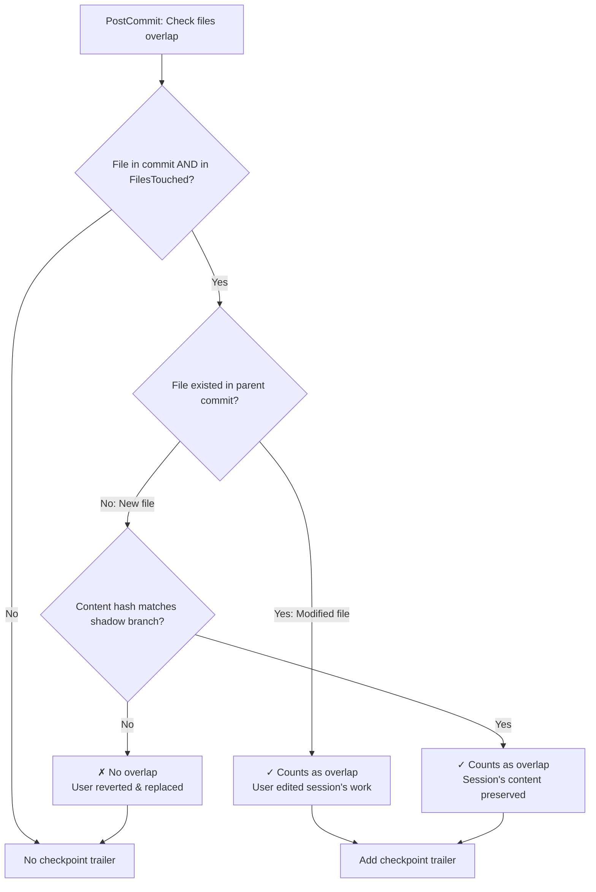

### Example: Reverted and Replaced

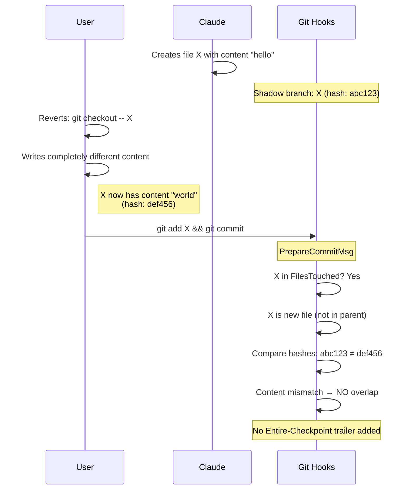

---

## Summary Table

| Scenario | When Checkpoint Created | Checkpoint Contains | Key Mechanism |
|----------|------------------------|---------------------|---------------|
| 1. User commits after prompt | PostCommit (IDLE) | Full transcript | Normal condensation |
| 2. Claude commits in turn | PostCommit (ACTIVE) + HandleTurnEnd | Full transcript (finalized at stop) | Deferred finalization |
| 3. Multiple Claude commits | Each PostCommit (ACTIVE) + HandleTurnEnd | Full transcript per checkpoint | TurnCheckpointIDs tracking |
| 4. User splits commits | Each PostCommit (IDLE) | Full transcript per checkpoint | Content-aware carry-forward |
| 5. Partial commit + stash + new prompt + commit new | PostCommit (IDLE) | Full transcript (both prompts) | FilesTouched accumulation, stashed files "fall out" |
| 6. Stash + new prompt + unstash + commit all | PostCommit (IDLE) | All files + full transcript | Shadow branch accumulation |
| 7. Partial staging with `git add -p` | Each PostCommit (IDLE) | Full transcript per checkpoint | Content-aware carry-forward (hash comparison) |

---

## Known Caveats

### 1. Redundant Transcript Data Across Commits

Each checkpoint stores the **full session transcript** up to that point. If a session results in multiple commits (Scenarios 3, 4, 5, 6), each checkpoint contains overlapping transcript data.

**Example**: Session with 3 commits
- Checkpoint 1: transcript lines 1-100
- Checkpoint 2: transcript lines 1-200 (includes 1-100 again)
- Checkpoint 3: transcript lines 1-300 (includes 1-200 again)

**Trade-off**: This simplifies checkpoint retrieval (each is self-contained) at the cost of storage efficiency.

### 2. Token Usage Sums Are Misleading

Each checkpoint's `metadata.json` contains cumulative token usage for the entire session up to that point. Summing token counts across multiple checkpoints from the same session **double-counts tokens**.

**Example**:
- Checkpoint 1: 10,000 tokens (session total so far)
- Checkpoint 2: 25,000 tokens (session total so far)
- Naive sum: 35,000 tokens ❌
- Actual usage: 25,000 tokens ✓

**Correct approach**: Use the token count from the **last checkpoint** of a session, or track incremental deltas separately.

### 3. Stashed Files Lose Shadow Content

As described in Scenario 5, if files are stashed and other files are committed first, the stashed files lose their content in the shadow branch. They remain tracked by filename in `FilesTouched`, but subsequent checkpoints won't have the original file content preserved.

### 4. No Per-File Prompt Attribution

Checkpoints don't explicitly tag which prompt created which file. To determine this, you must parse the transcript and correlate `tool_use` entries with preceding `user` messages. The `files_touched` list in metadata is cumulative across all prompts.

### 5. Carry-Forward Checkpoints Include Full Transcript

When files are carried forward (Scenario 4), `CheckpointTranscriptStart` is reset to 0. This means each carry-forward checkpoint includes the **entire transcript**, not just new content since the last checkpoint.

**Impact**: For long sessions with many partial commits, checkpoint storage grows linearly with session length × number of commits.

### 6. Crash Before HandleTurnEnd Leaves Provisional Transcripts

In Scenarios 2 and 3 (Claude commits during turn), checkpoints are saved with "provisional" transcripts during PostCommit. The full transcript is written at HandleTurnEnd (Stop hook).

If the session crashes or is killed before the Stop hook fires:
- Checkpoints exist with partial transcripts
- `TurnCheckpointIDs` in session state tracks which need finalization
- Next session start does **not** automatically finalize orphaned checkpoints

### 7. Two Different Content-Aware Checks

The system uses two separate content-aware checks with different purposes:

**A. Overlap Detection** (`filesOverlapWithContent`) - Determines if commit should be linked to session:
- Only applies to **newly created files**
- Modified files (existed in parent) **always count as overlap**
- Used in PrepareCommitMsg/PostCommit for non-ACTIVE sessions
- **Purpose**: Prevent linking commits where user reverted session content

**B. Carry-Forward Detection** (`filesWithRemainingAgentChanges`) - Determines which files to carry forward:
- Applies to **all committed files**
- Compares committed content hash vs shadow branch hash
- Hash mismatch = partial commit, file carried forward
- **Purpose**: Enable splitting changes within a file across commits (Scenario 7)

### 8. Carry-Forward Content Superseded by New Prompts

When files are carried forward and then a new prompt modifies the same file:
- The shadow branch gets the **new** content (from the new prompt's SaveChanges)
- The carried-forward content is overwritten
- Subsequent commits compare against the **new prompt's content**, not the original carried-forward content

**Example**:
1. Prompt 1: Agent writes 100 lines to file A
2. User commits 50 lines via `git add -p`
3. Carry-forward: A (with 100 lines) goes to new shadow branch
4. Prompt 2: Agent adds 50 more lines to A (now 150 lines total in worktree)
5. SaveChanges: Shadow branch now has A with 150 lines
6. User commits: Comparison is against 150 lines, not original 100 lines

This is correct behavior - the shadow branch reflects the **current combined state** of the session's work.

### 9. Automatic Cleanup During Normal Operations

Most orphaned data is cleaned up automatically:

- **Shadow branches**: Deleted after condensation if no other sessions reference them
- **Session states**: Cleaned up during session listing when shadow branch no longer exists (and session is not ACTIVE, has no `LastCheckpointID`)

For anything that slips through, run `entire clean` manually:

```bash
entire clean          # Preview orphaned items
entire clean --force  # Delete orphaned items
```
